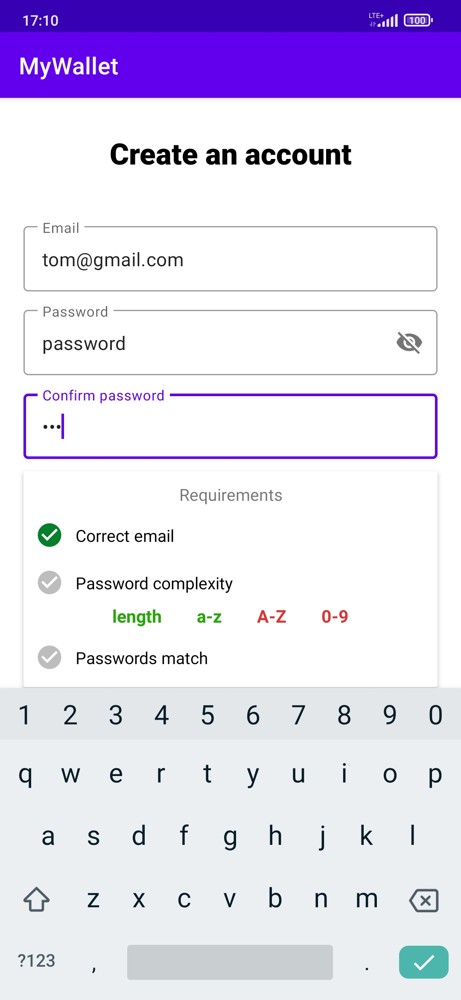
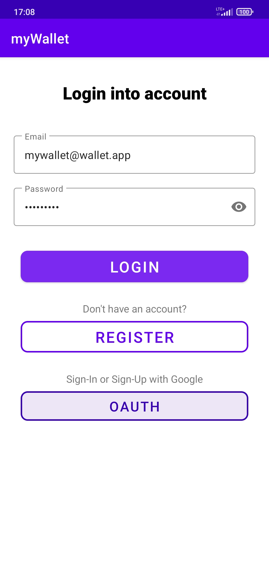
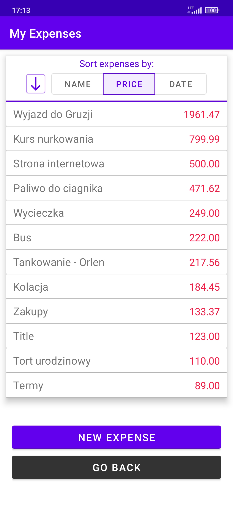
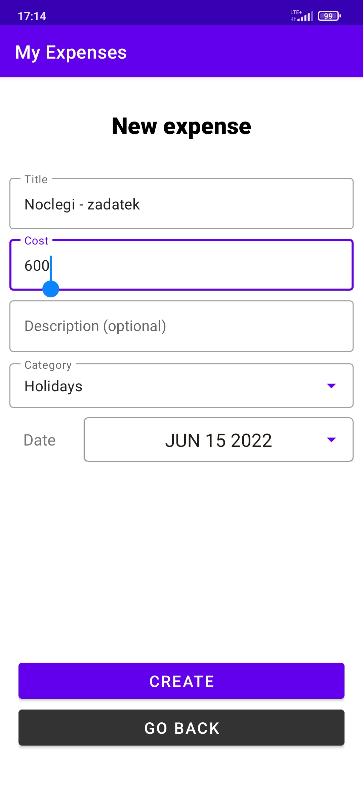
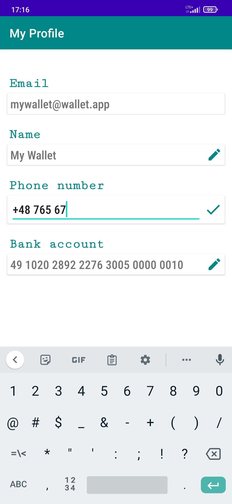
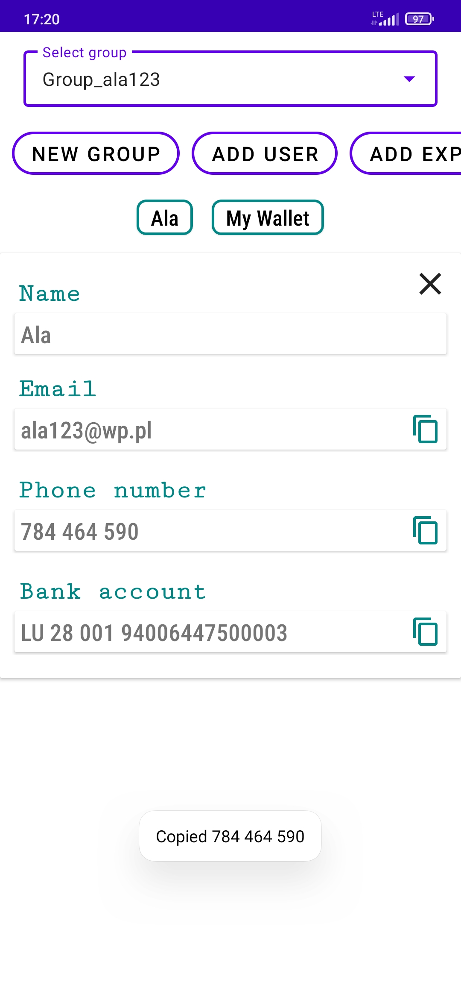
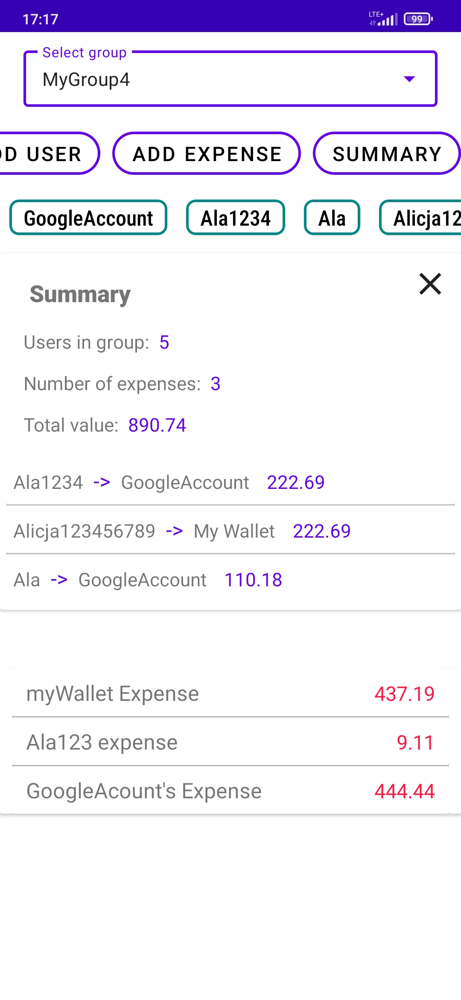
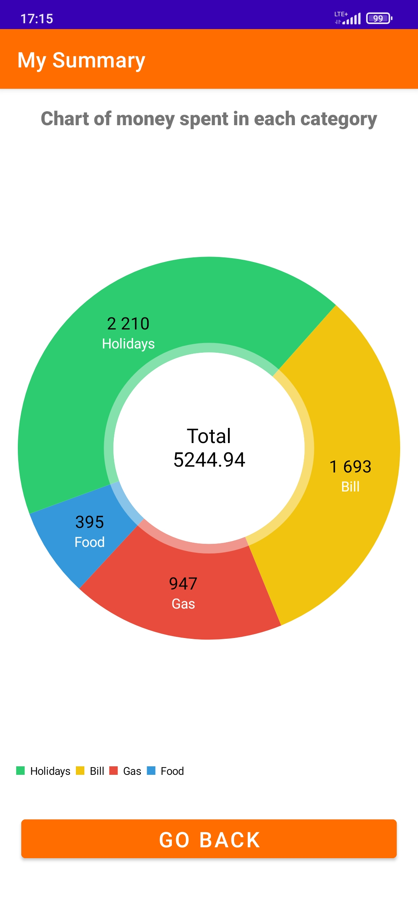

# WalletApp
WalletApp is an android application for tracking expenses and sharing them with your friends.

## Features
- Create or join an existing **group of friends**
- Invite new friends
- Share your expenses
- Split expenses smartly (with built-in minimum-cash-flow algorithm)
- Obtain **friends' phone/banking numbers** from their profiles
- **Google Authentication**
- **Dynamic Expenses**
- **Dynamic summary charts**

## Screenshots

  
  
  

  
  
  
  

  
  
  

## Tech Stack

**Client:** Java 18, Android API 32

**Server:** Google Firebase

## Installation

Simply download source code and run it in Android Studio.

## Authors
[@mateuszocwieja](https://www.github.com/cwirex)

